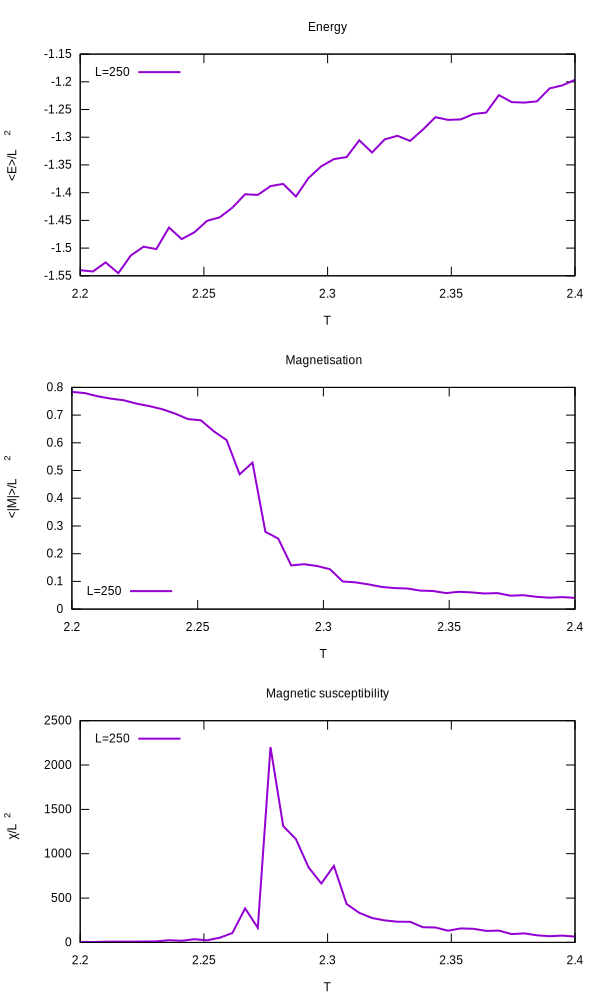

# Project 4

Parallelised using coarrays.

Installation of OpenCoarrays: `git clone git@github.com:sourceryinstitute/OpenCoarrays && cd OpenCoarrays && mkdir build && cd build && cmake .. && make -j4 && sudo make install`

Compiling: `make example`.
Run program (may take months): `mpirun ./example`.
Plot results: `gnuplot plot.gpi`
