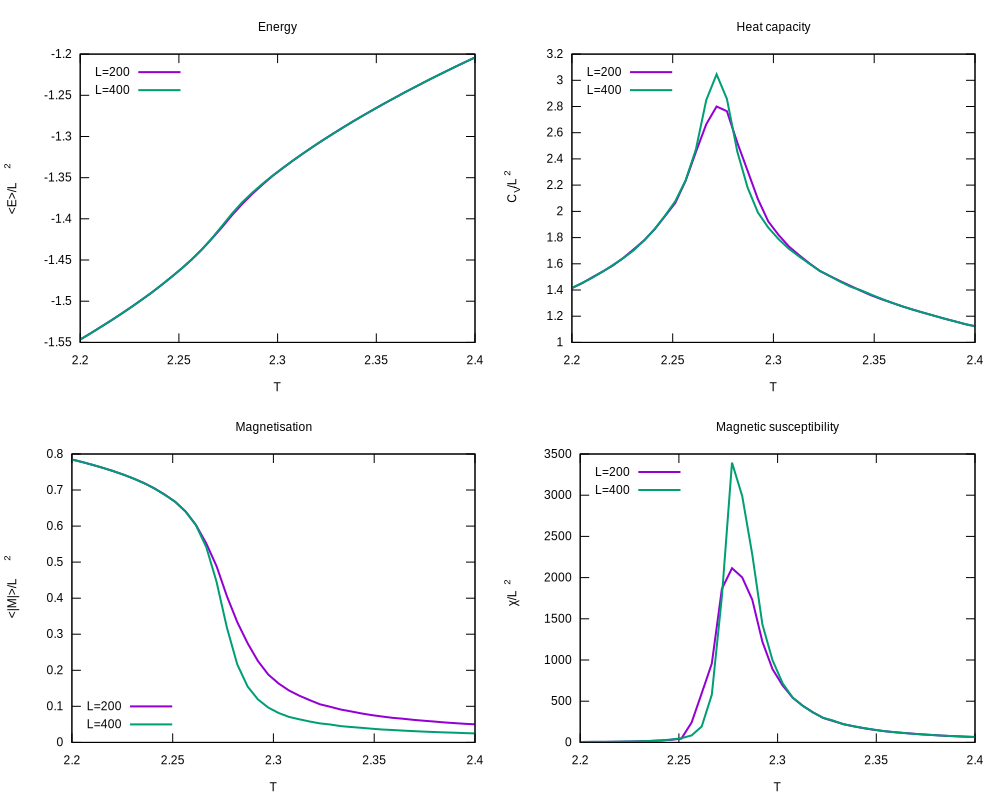

# Project 4

Better plot with more data on the way.

Parallelised using coarrays.

Installation: `git clone git@github.com:sourceryinstitute/OpenCoarrays && cd OpenCoarrays && mkdir build && cd build && cmake .. && make -j4 && sudo make install`

Compiling this project: `make example && mpirun ./example`.
